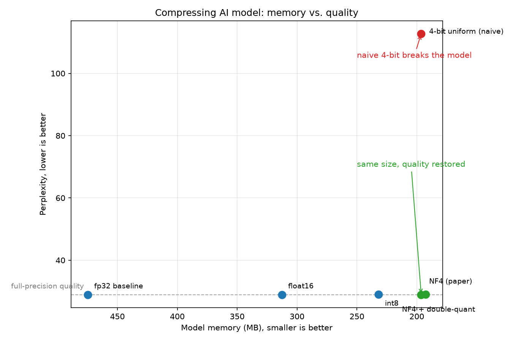

# Shrinking an AI model: a hands-on tour of model quantization

> Why are data centers so hungry for memory, and how do we make AI models need less of it?

Modern AI models are enormous. Running them takes an insane amount of memory and compute, and a
big part of that cost is simply **storing the model's weights**: the billions, now sometimes
trillions, of numbers learned during training that hold everything the model knows. The largest
models are so big their exact parameter counts are no longer disclosed.

Shrinking that footprint is an active problem with many approaches. The most accessible is
shrinking the numbers themselves, which is what this repository does.

This repository is a simple, **hands-on, runnable walkthrough** of how to make a model smaller, so
it needs less memory while keeping its quality close to the original. The core idea is
**quantization** (storing each weight in fewer bits). You run six short scripts in order on a small
open LLM (**GPT-2**, 124M parameters) and watch two numbers at every step: how much **memory** the
model uses, and how much **quality** you keep. It ends with two techniques from the **QLoRA paper**
([Dettmers et al., 2023](https://arxiv.org/abs/2305.14314)).

The point isn't just "compression." It's that *naive* compression **breaks** the model, and the
paper's tricks make aggressive compression actually work. You'll see that happen with your own eyes.

## The bigger picture: where this fits

Making large models cheaper to store, run, and train is a whole field, and it comes at the problem
from several directions:

- **Quantization**: store each number in fewer bits.
- **Spreading a model across many machines**: when it is too big for one GPU, split the model and
  its training across many.
- **Using each chip more efficiently**: fit more work into the same memory and compute.
- **Faster communication between chips**: when many GPUs act as one, moving data between them
  quickly is its own challenge.
- **More efficient hardware**: chips designed to run these models with less memory and energy.
- **Simplifying the model itself**: removing or shrinking the parts that matter least.

This repository lives in the first one, quantization, applied to running models. The QLoRA paper it
builds toward combines that with small trainable add-ons (LoRA), which is what makes fine-tuning a
very large model affordable. I plan to cover other parts of this landscape in future repositories.

## The claims you'll verify

If you run every step (instructions below), you should reproduce this table. **Memory numbers are
exact**; perplexity should match to about ±0.05 depending on your PyTorch version and hardware.


| Step | Technique                     | Memory   | Perplexity (lower is better)   |
| ---- | ----------------------------- | -------- | ------------------------------ |
| 1    | fp32 baseline                 | 474.7 MB | 28.92                          |
| 2    | float16                       | 312.7 MB | 28.92                          |
| 3    | int8 (per-channel)            | 231.9 MB | 28.96                          |
| 4    | 4-bit uniform (naive)         | 196.3 MB | **112.74** (the cliff)         |
| 5    | 4-bit **NF4** (paper)         | 196.3 MB | **28.94** (rescued, same size) |
| 6    | NF4 + **double quantization** | 192.5 MB | 29.05                          |


Read it top to bottom. Memory falls, then at step 4 quality falls off a **cliff** (perplexity
29 to 113), and at step 5 the paper's **NF4** format brings quality all the way back **at the same
memory**. Step 6 squeezes out a little more.




## 1. Requirements

- **Python 3.10+**
- **~1 GB free disk** (GPT-2 downloads to a local cache the first time, ~500 MB)
- A GPU is **not** required. Everything runs on CPU in a minute or two per step.

## 2. Setup

```bash
# (recommended) create a clean environment
python -m venv .venv
# Windows:
.venv\Scripts\activate
# macOS / Linux:
source .venv/bin/activate

# install dependencies
pip install -r requirements.txt
```

No API key is needed; GPT-2 is a public model. (`.env.example` is included only to keep this
repo's structure consistent with my other projects; you can ignore it here.)

## 3. Run it, step by step

Run the steps **in order**. Each script is self-contained, so you can open it and read it top to
bottom; it's written to be understood even if you don't write PyTorch. The first script triggers
the one-time GPT-2 download.

### Step 1. Baseline: measure the starting point

```bash
python Baseline-and-measuring-memory/step1.py
```

**What it does:** loads GPT-2 at full precision (float32) and prints the two numbers every later
step tries to improve (total weight memory, and perplexity on a fixed passage), plus a short text
generation so you can see it's a real, working model.

**Why:** you can't claim "smaller and still works" without a starting line. This is it.

**Expected output:**

```
Model:        gpt2
Device:       cpu
Parameters:   124.4 M
Memory (fp32):   474.7 MB
Perplexity:      28.92  (lower is better)

Prompt:  In the future, artificial intelligence will
Sample:  In the future, artificial intelligence will be able to do things like search for information about people, and to do things like search for information
```

### Step 2. float16: the free 2×

```bash
python Half-precision/step2.py
```

**What it does:** stores each transformer-block weight in 16 bits instead of 32 (the same number,
fewer digits).

**Why:** it's the simplest possible win and a sanity check. Halving the bits should roughly halve
the block-weight memory with no measurable quality loss.

**In other words:** write each number with fewer decimals, like 3.14 instead of 3.14159265. Close enough, half the space.

**Expected output:**

```
Technique:    float16 (half precision) on transformer block weights
Memory:         474.7 MB  ->    312.7 MB   (1.52x smaller)
Perplexity:     28.92   (baseline was 28.92, lower is better)
```

Perplexity is unchanged; float16 is essentially lossless here.

### Step 3. int8: 256 levels, one scale per channel

```bash
python Eight-bit-quantization/step3.py
```

**What it does:** replaces each weight with an 8-bit integer (one of 256 levels) plus one scale
factor per output channel.

**Why:** it shows that you can leave "real numbers" behind entirely and still keep quality, as long
as each channel gets its own scale fitted to its largest value.

**In other words:** round each weight to the nearest of 256 preset sizes, with a separate ruler fitted to each column so nothing gets squashed.

**Expected output:**

```
Technique:    int8 (8-bit), one scale per output channel
Memory:         474.7 MB  ->    231.9 MB   (2.05x smaller)
Perplexity:     28.96   (baseline was 28.92, lower is better)
```

Still essentially lossless (28.96 vs 28.92), now at ~2× the original's compression.

### Step 4. 4-bit (naive): watch it break

```bash
python Four-bit-block-quantization/step4.py
```

**What it does:** pushes to 4 bits per weight (only 16 levels), in small blocks of 64 with a scale
each, packing two 4-bit values into every byte.

**Why:** to show the catch. 4 bits is so coarse that *uniform* (evenly spaced) levels can't
represent the weights well, and quality collapses.

**In other words:** offer only 16 evenly spaced sizes. Almost every weight falls between sizes, so the fit is bad and the model suffers.

**Expected output:**

```
Technique:    4-bit block quantization (block size 64), float32 scales
Memory:         474.7 MB  ->    196.3 MB   (2.42x smaller)
Perplexity:    112.74   (baseline was 28.92, lower is better)
```

**This is the cliff.** Memory dropped, but perplexity exploded from ~29 to ~113. The model is
badly damaged. This is the exact problem the QLoRA paper was built to solve.

### Step 5. NF4: the paper's fix, same memory

```bash
python NormalFloat-NF4/step5.py
```

**What it does:** keeps everything about step 4 the same (4 bits, blocks of 64) but changes *which*
16 values the codes map to. Neural-network weights cluster in a bell curve around zero, so NF4
("NormalFloat") places its 16 levels at the **quantiles of a normal distribution** (dense near
zero, sparse in the tails), so resolution lands where the weights actually are.

**Why:** to show that the failure in step 4 wasn't "4 bits is impossible," it was "evenly spaced
4 bits is wrong for this data." Smarter level placement, **zero extra memory**, fixes it.

**In other words:** keep the 16 sizes, but bunch them where the weights actually are (near zero) instead of wasting them on the rare large values.

**Expected output:**

```
Technique:    4-bit NF4 / NormalFloat (block size 64)
Memory:         474.7 MB  ->    196.3 MB   (2.42x smaller)
Perplexity:     28.94   (uniform 4-bit was 112.74; baseline 28.92)
```

Same 196.3 MB as step 4, but perplexity is back to **28.94**, essentially the full-precision
baseline. That's the headline result of this whole repo.

### Step 6. Double quantization: compress the scales too

```bash
python Double-quantization/step6.py
```

**What it does:** the second QLoRA trick. Every block of 64 weights still carries its own float32
scale; double quantization quantizes *those scales* to 8 bits (in second-level blocks of 256),
shrinking the bookkeeping without touching the weights.

**Why:** to show that you can even compress the compressor's own metadata. The saving is small on a
model this size, but on a 65B model the same trick saves gigabytes.

**In other words:** each block of weights keeps its own little ruler (its scale) to measure by. Now that the weights themselves are tiny, those rulers take up a real share of the space, so we store the rulers in fewer bits too.

**Expected output:**

```
Technique:    NF4 weights + 8-bit double-quantized scales (block 64/256)
Memory:         474.7 MB  ->    192.5 MB   (2.47x smaller)
Perplexity:     29.05   (baseline 28.92, NF4 without DQ ~28.94)
```

A few more megabytes off, quality essentially unchanged.

## 4. (Optional) Draw the results chart

Each step you run saves its measured memory and perplexity to `results/results.json`. Once you've
run all six, `make_chart.py` reads that file and plots them to  `results/perplexity_vs_memory.png`

```bash
pip install matplotlib
python make_chart.py
```


## How the two measurements work

- **Memory (MB)** is the total bytes of every weight the model holds (parameters + buffers). For
each tensor that's `number_of_values × bytes_per_value` (4 for float32, 2 for float16, 1 for
int8, 0.5 for packed 4-bit). We sum it across the whole model.
- **Perplexity** is `exp(average cross-entropy)` of the model on a fixed passage of text. It
measures how surprised the model is by real language, and **lower is better**. Damage from
over-aggressive quantization makes the model more surprised, so perplexity rises. We score the
*same* passage in every step so the numbers are comparable.

## Notes and honest caveats

- **Why only ~2.4× total, not 8×?** Only the transformer block weights (~85M params) are
quantized. GPT-2's token-embedding table (~39M params, ~158 MB in float32) is left at higher
precision on purpose, because quantizing it hurts quality for little gain. So the *block weights*
drop ~8× (340 MB to ~43 MB), while the *total* drops ~2.4× because the untouched fp32 embeddings
now dominate. Leaving embeddings and normalization layers at higher precision is exactly what
production quantizers do.
- **Speed vs. memory.** This is an educational, from-scratch implementation: weights are kept
compressed in memory and decompressed on the fly inside each forward pass. That trades inference
speed for clarity and low memory. Real systems use fused GPU kernels that decompress inside the
matmul, so they're fast *and* small.
- **NF4 isn't magic.** It wins big here because real LLM weights are genuinely bell-curved and we
measure aggregate quality (perplexity). On different data, or with a worst-case error metric,
evenly spaced (uniform) levels can actually beat NF4. The best level placement depends on the
distribution you actually have.
- **"Same perplexity" is not "same model."** This is the most important caveat. Perplexity on one
short passage is a coarse check. A 4-bit model can match it and still score measurably lower on
harder work (multi-step reasoning, math, code, long context), because quantization nudges
individual token predictions in ways a single averaged number hides. On easy text those nudges
wash out; on a tricky reasoning chain, one flipped token can derail the answer. Stronger checks
usually reveal a small but real drop. The quality
cost is rarely zero, it's just easy to miss with a weak metric.
- **So why don't large providers quantize everything to 4-bit?** Quantization pays off most when
memory is the binding constraint, which is the case when running an open model on a single
consumer GPU: 4-bit is the difference between "runs" and "doesn't run." Exact serving stacks
aren't public, but the general industry pattern is that flagship hosted models run at higher
precision (bf16/fp16, increasingly fp8 on newer hardware), not 4-bit. When you own the data
center, memory is not a hard wall and your best model's quality on the hard cases is the whole
product, so you would rather spend memory, or move to fp8 with proper kernels, than risk any
degradation. Aggressive 4-bit is a "fit it on the hardware I have" tool more than a free win.
- **Reproducibility.** Memory numbers are deterministic. Perplexity is computed with no randomness,
so it should match to ~±0.05; small differences can come from PyTorch version or hardware. The
step-1 text sample is greedy (deterministic) but can vary slightly across library versions.

